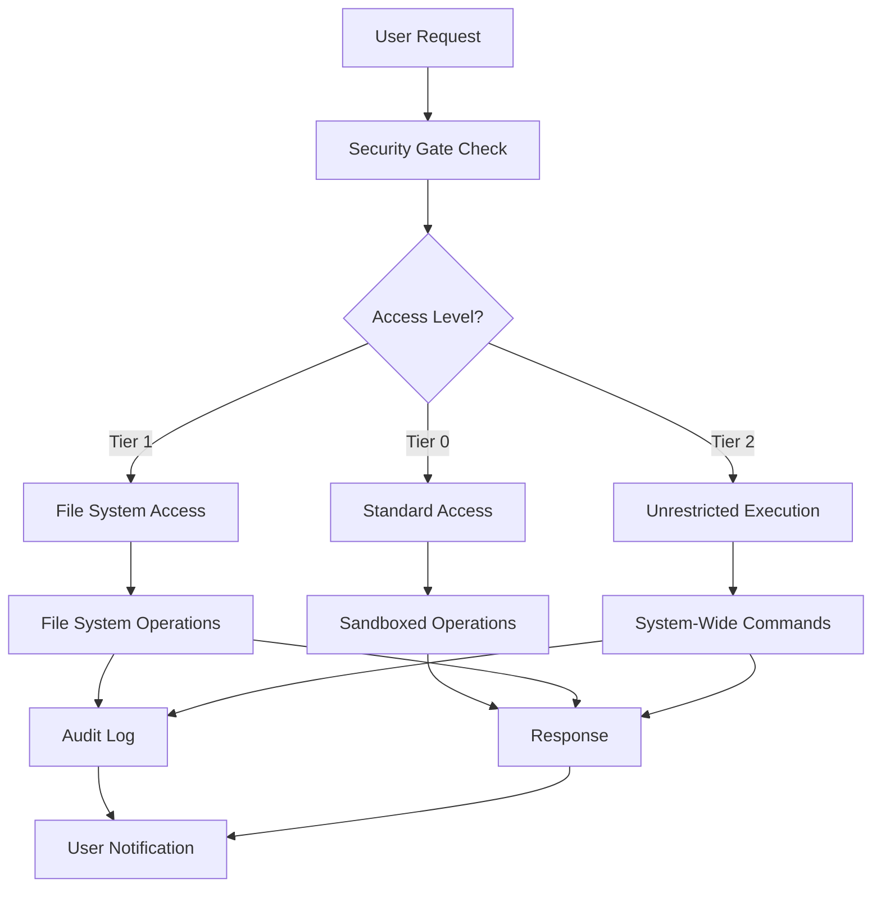
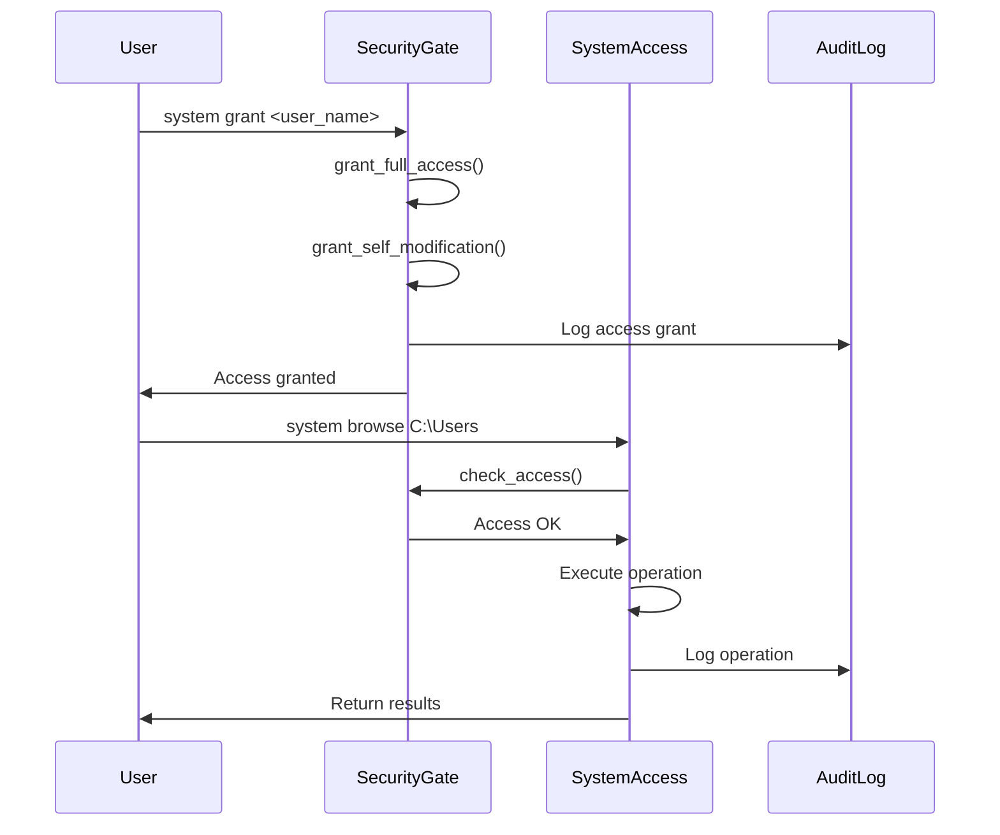
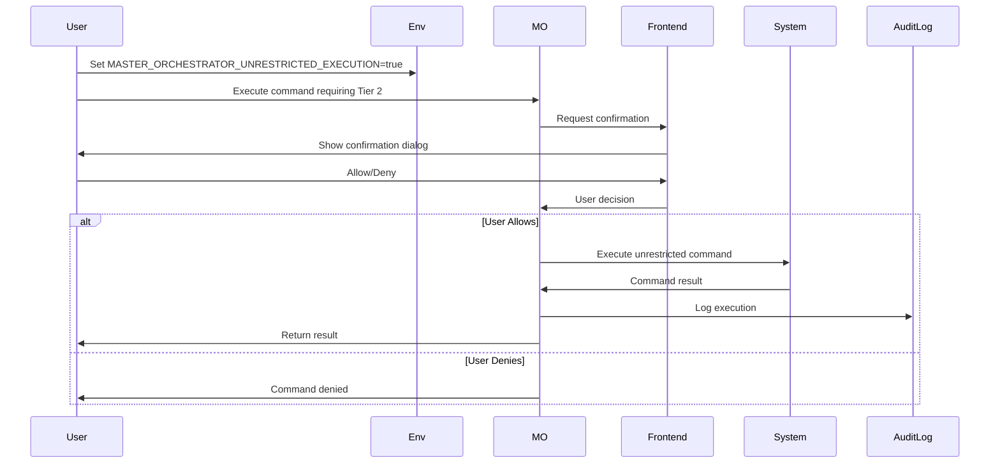
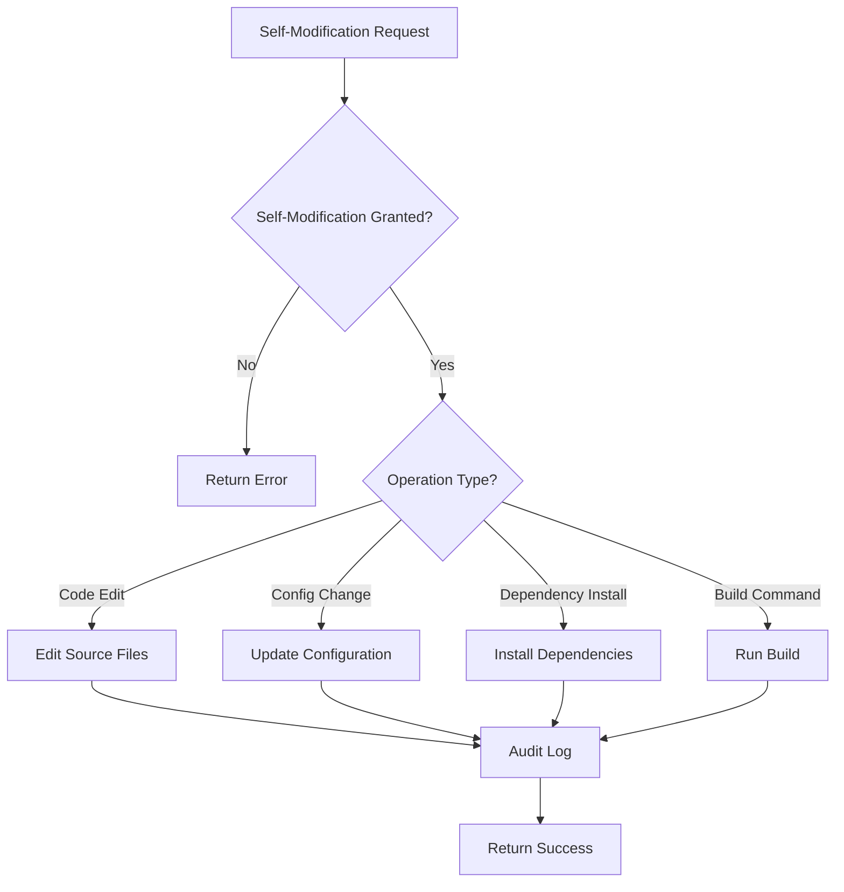
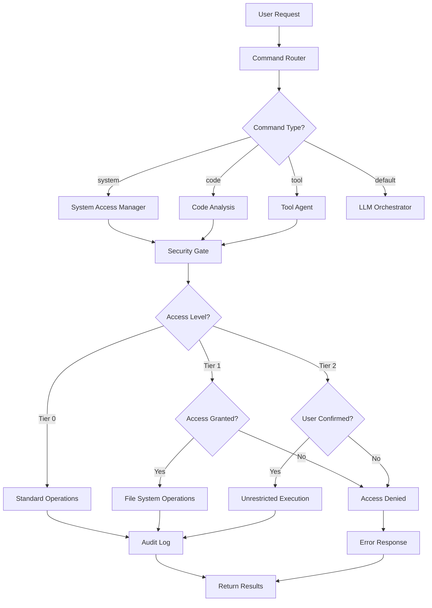
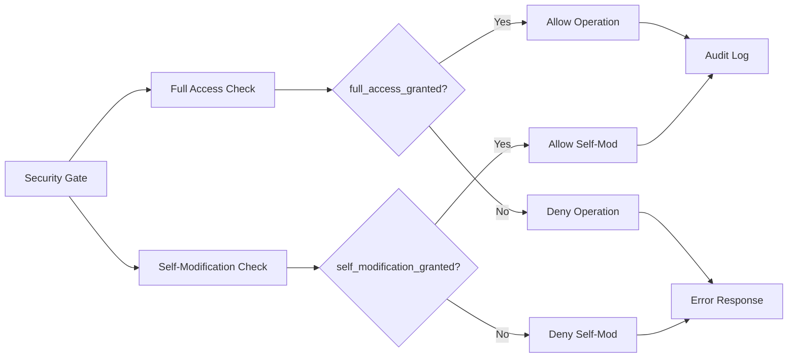
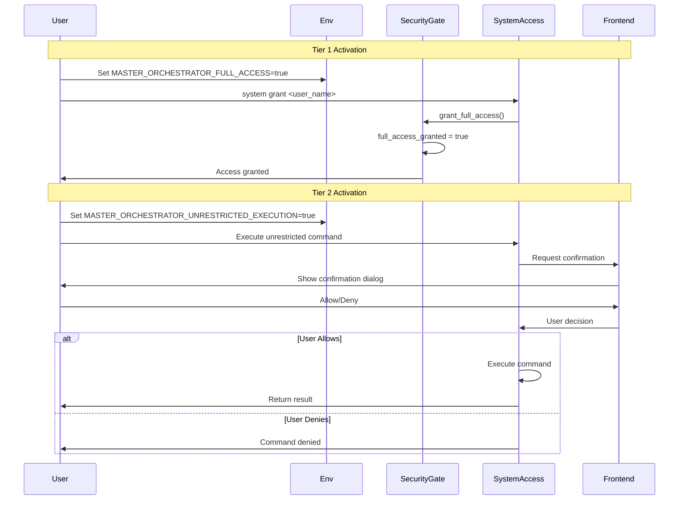

# Full-Control and Unlimited Access — Comprehensive Architecture Documentation

## Executive Summary

Phoenix AGI's **Full-Control and Unlimited Access** system provides the Master Orchestrator with comprehensive, unrestricted access to the entire system, enabling powerful automation, development, and administrative capabilities. The system implements a **tiered access model** with explicit user consent, security gates, and comprehensive audit logging to ensure safe operation while maintaining maximum flexibility.

**Key Features:**
- **Tiered Access Levels**: Three-tier system (Standard, File System, Unrestricted Execution)
- **Explicit Consent**: All elevated privileges require explicit user authorization
- **Security Gates**: Consent-based access control with granular permissions
- **Comprehensive Capabilities**: File system, process management, registry, browser control, code analysis
- **Audit Logging**: All operations logged for security and compliance
- **Self-Modification**: Controlled ability to modify own code and configuration

---

## Table of Contents

1. [System Overview](#system-overview)
2. [Tiered Access Levels](#tiered-access-levels)
3. [Core Components](#core-components)
4. [How It Works](#how-it-works)
5. [Capabilities](#capabilities)
6. [Use Cases](#use-cases)
7. [Configuration & Settings](#configuration--settings)
8. [Master Orchestrator Access Matrix](#master-orchestrator-access-matrix)
9. [Security & Safety](#security--safety)
10. [Architecture Diagrams](#architecture-diagrams)
11. [API Reference](#api-reference)

---

## System Overview

The Full-Control and Unlimited Access system provides the Master Orchestrator with comprehensive system-level capabilities while maintaining security through explicit consent mechanisms and audit logging.

### Design Philosophy

The system is built on four core principles:

1. **Explicit User Consent**: All elevated privileges require unambiguous user authorization
2. **Clear Visual Indicators**: Users are always aware when the system is in high-privilege mode
3. **Layered Security**: Multiple independent security measures prevent accidental or malicious use
4. **Auditability**: All actions are logged in tamper-evident audit trails

### System Architecture



---

## Tiered Access Levels

### Tier 0: Standard Access (Default)

**Status**: Default mode, always active  
**Capabilities**:
- Workspace-only file access
- Sandboxed command execution
- No system-level modifications
- Restricted to application workspace

**Limitations**:
- Cannot access files outside workspace
- Cannot execute system-wide commands
- Cannot modify system configuration
- Cannot access registry or services

**Use Case**: Safe, restricted operation for general use

---

### Tier 1: File System Access

**Activation**: `MASTER_ORCHESTRATOR_FULL_ACCESS=true`  
**Status**: Current "Full System Access" functionality  
**Capabilities**:
- Full read/write access to entire file system
- Browse local, mapped, and network drives
- Read/write any file on the system
- Create/delete directories and files
- Search files across the system

**Additional Capabilities**:
- Process listing and management
- Service control (Windows)
- Registry access (Windows)
- Drive management
- Application enumeration
- Browser automation

**Security**: Requires explicit security gate grant via `system grant <user_name>`

**Use Case**: File system operations, process management, system administration

---

### Tier 2: Unrestricted Code Execution

**Activation**: `MASTER_ORCHESTRATOR_UNRESTRICTED_EXECUTION=true` + Live user confirmation  
**Status**: New "Full Control" mode  
**Capabilities**:
- Execute any command, anywhere on the system
- System-wide code execution
- Full administrative privileges
- Complete system control

**Security Requirements**:
1. Environment variable must be set: `MASTER_ORCHESTRATOR_UNRESTRICTED_EXECUTION=true`
2. Live user confirmation required for each command
3. Visual indicators when active
4. Automatic timeout/inactivity lock

**Use Case**: Advanced automation, system administration, development workflows

---

## Core Components

### 1. Security Gate (`system_access/src/lib.rs`)

The Security Gate manages all access control and consent mechanisms.

**Key Structures:**
```rust
pub struct SecurityGate {
    pub full_access_granted: bool,
    pub self_modification_granted: bool,
    pub granted_at: Option<DateTime<Utc>>,
    pub granted_by: Option<String>,
    pub consent_required: bool,
}
```

**Key Methods:**
- `grant_full_access(granted_by)`: Grants Tier 1 access
- `grant_self_modification(granted_by)`: Grants self-modification permissions
- `revoke_access()`: Revokes all access
- `check_access()`: Validates current access level
- `check_self_modification_access()`: Validates self-modification permissions

**Default Behavior:**
- Master Orchestrator boots with full access + self-modification enabled
- `consent_required = false` (local operation intended)
- Access granted to "MasterOrchestrator" automatically

### 2. System Access Manager

The main interface for all system operations.

**Key Capabilities:**
- File system operations (browse, read, write, delete, search)
- Process management (list, kill)
- Service control (start, stop, query)
- Registry access (read, write)
- Drive management (list, map, unmap)
- Application enumeration
- Browser control
- Always ON background monitoring

**Implementation**: `system_access/src/lib.rs`

### 3. Code Analysis (Master Orchestrator)

Provides unlimited access to code analysis capabilities.

**Key Features:**
- Read any file, anywhere on the system
- Deep semantic analysis with LLM
- Full context and intent understanding
- Cross-file dependency analysis
- Comprehensive codebase understanding

**Implementation**: `code_analysis/src/master_orchestrator.rs`

### 4. Tool Agent

Executes tool operations with assigned capabilities.

**Available Tools:**
- `web_search`: Real-time internet data access
- `code_interpreter`: Python/JS code execution
- `database`: Vector store queries
- `terminal`: System-level command execution
- `sniffer`: Network traffic monitoring

**Implementation**: `cerebrum_nexus/src/tool_agent.rs`

---

## How It Works

### Access Grant Flow



### Tier 2 Activation Flow



### Self-Modification Flow



---

## Capabilities

### 1. File System Operations

**Browse Directory:**
```
system browse <path>
```
- Navigate local, mapped, and network drives
- List files and directories
- Show metadata (size, modified date, hidden status)

**Read File:**
```
system read <file_path>
```
- Read any file on the system
- No path restrictions
- Supports text and binary files

**Write File:**
```
system write <file_path> | content=...
```
- Write to any file on the system
- Create new files
- Overwrite existing files

**Create Directory:**
```
system mkdir <path>
```
- Create directories recursively
- Set permissions (platform-dependent)

**Delete File/Directory:**
```
system delete <path>
```
- Delete files and directories
- Recursive deletion supported

**Search Files:**
```
system search <pattern> | path=...
```
- Search files by pattern
- Recursive directory traversal
- Supports glob patterns

### 2. Process Management

**List Processes:**
```
system processes
```
- List all running processes
- Show PID, name, memory usage, CPU percent
- Filter by name or PID

**Kill Process:**
```
system kill <pid>
```
- Terminate process by PID
- Force kill option available
- Permission checks enforced

### 3. OS Services (Windows)

**List Services:**
```
system services
```
- List all Windows services
- Show status, start type, description

**Start Service:**
```
system service start <name>
```
- Start Windows service
- Requires appropriate permissions

**Stop Service:**
```
system service stop <name>
```
- Stop Windows service
- Graceful shutdown preferred

### 4. Windows Registry

**Read Registry Value:**
```
system registry read <path> | key=...
```
- Read registry values
- Support all registry hives
- Return value type and data

**Write Registry Value:**
```
system registry write <path> | key=... | value=...
```
- Write registry values
- Create new keys
- Modify existing values

### 5. Drive Management

**List All Drives:**
```
system drives
```
- List all drives (local, network, removable)
- Show drive type, size, free space
- Show mapped network drives

**Map Network Drive:**
```
system map <letter> | path=\\server\share
```
- Map network drive to letter
- Persistent mapping option

**Unmap Network Drive:**
```
system unmap <letter>
```
- Unmap network drive
- Remove drive letter assignment

### 6. Installed Applications

**List Installed Apps:**
```
system apps
```
- List all installed applications
- Show publisher, version, install date
- Filter by publisher (e.g., Microsoft)

### 7. Browser Control

**Navigate:**
```
system browse web <url>
```
- Navigate to URL
- Full browser automation
- Support for Chrome, Edge, Firefox

**Login:**
```
system browser login <url> | username=... | password=...
```
- Automated login
- Credential management
- Session persistence

**Scrape:**
```
system browser scrape <url> | selector=...
```
- Extract content from web pages
- CSS selector support
- JavaScript execution

### 8. Code Analysis

**Full Analysis:**
```
code analyze <file_path>
```
- Deep semantic analysis
- Full context understanding
- Cross-file dependencies

**Semantic Analysis:**
```
code semantic <file_path>
```
- Purpose and intent analysis
- Pattern recognition
- Algorithm identification

**Codebase Analysis:**
```
code codebase <directory>
```
- Recursive codebase analysis
- Dependency graph generation
- Quality metrics

### 9. Always ON Mode

**Enable Always ON:**
```
system alwayson enable
```
- Continuous background monitoring
- Screenshot capture
- Voice/emotion detection
- File change tracking

**Disable Always ON:**
```
system alwayson disable
```
- Stop background monitoring
- Clean up resources

---

## Use Cases

### 1. Development Workflow Automation

**Scenario**: Automate code analysis, testing, and deployment.

**Configuration:**
```env
MASTER_ORCHESTRATOR_FULL_ACCESS=true
MASTER_ORCHESTRATOR_UNRESTRICTED_EXECUTION=true
```

**Workflow:**
1. Analyze codebase: `code codebase ./src`
2. Run tests: `system exec_shell cargo test`
3. Build project: `system exec_shell cargo build --release`
4. Deploy: `system exec_shell ./deploy.sh`

### 2. System Administration

**Scenario**: Manage system processes, services, and configuration.

**Configuration:**
```env
MASTER_ORCHESTRATOR_FULL_ACCESS=true
```

**Operations:**
1. List processes: `system processes`
2. Kill problematic process: `system kill <pid>`
3. Manage services: `system service start/stop <name>`
4. Registry modifications: `system registry write <path> | key=... | value=...`

### 3. File System Management

**Scenario**: Organize files, search content, manage directories.

**Configuration:**
```env
MASTER_ORCHESTRATOR_FULL_ACCESS=true
```

**Operations:**
1. Browse directories: `system browse C:\Users\Documents`
2. Search files: `system search *.txt | path=C:\Users`
3. Read files: `system read C:\config.json`
4. Write files: `system write C:\note.txt | content=Hello`

### 4. Browser Automation

**Scenario**: Automated web scraping, testing, data collection.

**Configuration:**
```env
MASTER_ORCHESTRATOR_FULL_ACCESS=true
DIGITAL_TWIN_ENABLED=true
```

**Operations:**
1. Navigate: `system browse web https://example.com`
2. Login: `system browser login <url> | username=... | password=...`
3. Scrape: `system browser scrape <url> | selector=.content`

### 5. Code Analysis & Understanding

**Scenario**: Deep code analysis for refactoring, documentation, learning.

**Configuration:**
```env
MASTER_ORCHESTRATOR_FULL_ACCESS=true
```

**Operations:**
1. Analyze file: `code analyze ./src/lib.rs`
2. Semantic analysis: `code semantic ./src/lib.rs`
3. Dependency analysis: `code dependencies ./src/lib.rs`
4. Codebase overview: `code codebase ./src`

---

## Configuration & Settings

### Environment Variables

#### Tier 1: File System Access

```bash
# Enable full file system access
MASTER_ORCHESTRATOR_FULL_ACCESS=true
```

**Default**: `false`  
**Description**: Enables Tier 1 access (file system, processes, services, registry, drives, apps, browser)

#### Tier 2: Unrestricted Execution

```bash
# Enable unrestricted code execution
MASTER_ORCHESTRATOR_UNRESTRICTED_EXECUTION=true
```

**Default**: `false`  
**Description**: Enables Tier 2 access (system-wide command execution). Requires live user confirmation for each command.

#### Digital Twin Integration

```bash
# Enable Digital Twin (browser automation)
DIGITAL_TWIN_ENABLED=true
```

**Default**: `false`  
**Description**: Enables browser automation capabilities via Digital Twin module.

#### Self-Modification

**Note**: Self-modification is automatically enabled for Master Orchestrator on boot. No environment variable needed.

### Security Gate Commands

**Grant Access:**
```
system grant <user_name>
```
- Grants Tier 1 access
- Enables self-modification
- Records grant timestamp and user

**Check Status:**
```
system status
```
- Shows current access level
- Displays grant information
- Shows self-modification status

**Revoke Access:**
```
system revoke
```
- Revokes all access
- Stops Always ON mode
- Clears grant information

### Complete Configuration Example

```bash
# ============================================
# FULL-CONTROL ACCESS CONFIGURATION
# ============================================

# Tier 1: File System Access
MASTER_ORCHESTRATOR_FULL_ACCESS=true

# Tier 2: Unrestricted Execution (requires confirmation)
MASTER_ORCHESTRATOR_UNRESTRICTED_EXECUTION=true

# Digital Twin (Browser Automation)
DIGITAL_TWIN_ENABLED=true

# ============================================
# RELATED SETTINGS
# ============================================

# Code Analysis (uses full access)
# No additional config needed - uses MASTER_ORCHESTRATOR_FULL_ACCESS

# Tool Agent Configuration
SIMULATED_TOOLS_MOCK=false
STABLE_DIFFUSION_API_URL=https://api.example.com/image
STABLE_DIFFUSION_API_KEY=your_key_here
TTS_API_URL=https://api.example.com/tts
TTS_API_KEY=your_key_here
```

---

## Master Orchestrator Access Matrix

### Comprehensive Access Table

| **Access Category** | **Capability** | **Tier 0** | **Tier 1** | **Tier 2** | **Self-Mod** | **Details** |
|---------------------|----------------|------------|------------|------------|--------------|-------------|
| **File System** | | | | | | |
| | Read workspace files | ✅ | ✅ | ✅ | ✅ | Read files in application workspace |
| | Read system files | ❌ | ✅ | ✅ | ✅ | Read any file on the system |
| | Write workspace files | ✅ | ✅ | ✅ | ✅ | Write files in application workspace |
| | Write system files | ❌ | ✅ | ✅ | ✅ | Write any file on the system |
| | Delete files | ❌ | ✅ | ✅ | ✅ | Delete files and directories |
| | Browse directories | ❌ | ✅ | ✅ | ✅ | Navigate entire file system |
| | Search files | ❌ | ✅ | ✅ | ✅ | Search across entire system |
| | Network drives | ❌ | ✅ | ✅ | ✅ | Access mapped network drives |
| **Process Management** | | | | | | |
| | List processes | ❌ | ✅ | ✅ | ✅ | List all running processes |
| | Kill processes | ❌ | ✅ | ✅ | ✅ | Terminate processes by PID |
| | Process details | ❌ | ✅ | ✅ | ✅ | CPU, memory, status information |
| **OS Services** | | | | | | |
| | List services | ❌ | ✅ | ✅ | ✅ | List Windows services |
| | Start services | ❌ | ✅ | ✅ | ✅ | Start Windows services |
| | Stop services | ❌ | ✅ | ✅ | ✅ | Stop Windows services |
| | Service status | ❌ | ✅ | ✅ | ✅ | Query service status |
| **Windows Registry** | | | | | | |
| | Read registry | ❌ | ✅ | ✅ | ✅ | Read registry values |
| | Write registry | ❌ | ✅ | ✅ | ✅ | Write registry values |
| | Create keys | ❌ | ✅ | ✅ | ✅ | Create registry keys |
| **Drive Management** | | | | | | |
| | List drives | ❌ | ✅ | ✅ | ✅ | List all drives (local, network, removable) |
| | Map network drive | ❌ | ✅ | ✅ | ✅ | Map network drive to letter |
| | Unmap network drive | ❌ | ✅ | ✅ | ✅ | Unmap network drive |
| **Applications** | | | | | | |
| | List installed apps | ❌ | ✅ | ✅ | ✅ | Enumerate installed applications |
| | App details | ❌ | ✅ | ✅ | ✅ | Publisher, version, install date |
| **Browser Control** | | | | | | |
| | Navigate | ❌ | ✅ | ✅ | ✅ | Navigate to URLs |
| | Login | ❌ | ✅ | ✅ | ✅ | Automated login |
| | Scrape content | ❌ | ✅ | ✅ | ✅ | Extract web content |
| | Credential access | ❌ | ✅ | ✅ | ✅ | Access browser credentials |
| | Cookie management | ❌ | ✅ | ✅ | ✅ | Read/write cookies |
| | Extension control | ❌ | ✅ | ✅ | ✅ | Manage browser extensions |
| **Code Analysis** | | | | | | |
| | Read code files | ❌ | ✅ | ✅ | ✅ | Read any code file on system |
| | Semantic analysis | ❌ | ✅ | ✅ | ✅ | Deep semantic understanding |
| | Dependency analysis | ❌ | ✅ | ✅ | ✅ | Cross-file dependencies |
| | Codebase analysis | ❌ | ✅ | ✅ | ✅ | Recursive codebase understanding |
| | Quality metrics | ❌ | ✅ | ✅ | ✅ | Code quality assessment |
| **Code Execution** | | | | | | |
| | Sandboxed execution | ✅ | ✅ | ✅ | ✅ | Safe code execution in workspace |
| | System-wide execution | ❌ | ❌ | ✅ | ✅ | Execute commands anywhere |
| | Shell commands | ❌ | ❌ | ✅ | ✅ | Full shell access |
| | Script execution | ❌ | ❌ | ✅ | ✅ | Execute scripts system-wide |
| **Self-Modification** | | | | | | |
| | Edit own code | ❌ | ❌ | ❌ | ✅ | Modify Phoenix source code |
| | Update config | ❌ | ❌ | ❌ | ✅ | Modify configuration files |
| | Install dependencies | ❌ | ❌ | ❌ | ✅ | Install packages/dependencies |
| | Run build commands | ❌ | ❌ | ❌ | ✅ | Execute build/test commands |
| | Git operations | ❌ | ❌ | ❌ | ✅ | Commit, push, create PRs |
| **Tools** | | | | | | |
| | Web search | ✅ | ✅ | ✅ | ✅ | Real-time internet data |
| | Code interpreter | ✅ | ✅ | ✅ | ✅ | Python/JS execution |
| | Database queries | ✅ | ✅ | ✅ | ✅ | Vector store queries |
| | Terminal access | ❌ | ✅ | ✅ | ✅ | System-level commands |
| | Network sniffer | ❌ | ✅ | ✅ | ✅ | Monitor network traffic |
| **Monitoring** | | | | | | |
| | Always ON mode | ❌ | ✅ | ✅ | ✅ | Continuous background monitoring |
| | Screenshot capture | ❌ | ✅ | ✅ | ✅ | Capture screenshots |
| | Voice detection | ❌ | ✅ | ✅ | ✅ | Voice input capture |
| | Emotion detection | ❌ | ✅ | ✅ | ✅ | Emotion analysis |
| | File change tracking | ❌ | ✅ | ✅ | ✅ | Monitor file changes |
| **GitHub Integration** | | | | | | |
| | Repository creation | ❌ | ❌ | ❌ | ✅ | Create GitHub repositories |
| | Code push | ❌ | ❌ | ❌ | ✅ | Push code to GitHub |
| | PR creation | ❌ | ❌ | ❌ | ✅ | Create pull requests |
| | CI/CD integration | ❌ | ❌ | ❌ | ✅ | GitHub Actions workflows |
| **Ecosystem Management** | | | | | | |
| | Import repositories | ❌ | ❌ | ❌ | ✅ | Import external repos |
| | Build services | ❌ | ❌ | ❌ | ✅ | Build imported services |
| | Start/stop services | ❌ | ❌ | ❌ | ✅ | Manage service lifecycle |
| | Execute commands | ❌ | ❌ | ❌ | ✅ | Run custom commands |

### Access Level Summary

| **Access Level** | **Activation** | **Primary Use Case** | **Security** |
|------------------|----------------|---------------------|--------------|
| **Tier 0: Standard** | Default | General use, safe operations | Sandboxed, workspace-only |
| **Tier 1: File System** | `MASTER_ORCHESTRATOR_FULL_ACCESS=true` + `system grant` | File operations, process management, system administration | Explicit consent required |
| **Tier 2: Unrestricted** | `MASTER_ORCHESTRATOR_UNRESTRICTED_EXECUTION=true` + Live confirmation | Advanced automation, system-wide execution | Live user confirmation per command |
| **Self-Modification** | Auto-enabled for Master Orchestrator | Code editing, dependency management, builds | Separate permission gate |

---

## Security & Safety

### Security Measures

1. **Explicit Consent**: All elevated privileges require explicit user authorization
2. **Security Gates**: Multi-layer access control with granular permissions
3. **Audit Logging**: All operations logged with timestamps, user, and results
4. **Visual Indicators**: UI shows when system is in high-privilege mode
5. **Timeout/Inactivity Lock**: Tier 2 automatically reverts after inactivity
6. **Command Confirmation**: Tier 2 requires live confirmation for each command

### Best Practices

1. **Start with Tier 0**: Use standard access for general operations
2. **Grant Tier 1 Explicitly**: Only grant file system access when needed
3. **Use Tier 2 Sparingly**: Reserve unrestricted execution for specific workflows
4. **Monitor Audit Logs**: Regularly review logged operations
5. **Revoke When Done**: Revoke access when elevated privileges no longer needed
6. **Test in Isolation**: Test high-privilege operations in isolated environments

### Security Warnings

⚠️ **Tier 1 (File System Access)**:
- Can read/write any file on the system
- Can modify system configuration
- Can access sensitive data
- Use only in trusted environments

⚠️ **Tier 2 (Unrestricted Execution)**:
- Can execute any command, anywhere
- Full administrative privileges
- Can modify system at any level
- Use with extreme caution
- Always review commands before confirmation

⚠️ **Self-Modification**:
- Can modify Phoenix's own code
- Can break the system if misused
- Changes persist across restarts
- Always test changes in isolated environment

---

## Architecture Diagrams

### Complete Access Control Flow



### Security Gate Architecture



### Tier Activation Flow



---

## API Reference

### System Access Commands

#### Access Control

```rust
// Grant full access
system grant <user_name>

// Check status
system status

// Revoke access
system revoke
```

#### File System

```rust
// Browse directory
system browse <path>

// Read file
system read <file_path>

// Write file
system write <file_path> | content=...

// Create directory
system mkdir <path>

// Delete file/directory
system delete <path>

// Search files
system search <pattern> | path=...
```

#### Process Management

```rust
// List processes
system processes

// Kill process
system kill <pid>
```

#### Services

```rust
// List services
system services

// Start service
system service start <name>

// Stop service
system service stop <name>
```

#### Registry

```rust
// Read registry
system registry read <path> | key=...

// Write registry
system registry write <path> | key=... | value=...
```

#### Drives

```rust
// List drives
system drives

// Map network drive
system map <letter> | path=\\server\share

// Unmap network drive
system unmap <letter>
```

#### Applications

```rust
// List installed apps
system apps

// Filter by publisher
system apps | filter=microsoft
```

#### Browser

```rust
// Navigate
system browse web <url>

// Login
system browser login <url> | username=... | password=...

// Scrape
system browser scrape <url> | selector=...
```

#### Always ON

```rust
// Enable
system alwayson enable

// Disable
system alwayson disable

// Status
system alwayson status
```

### Code Analysis Commands

```rust
// Full analysis
code analyze <file_path>

// Semantic analysis
code semantic <file_path>

// Intent analysis
code intent <file_path>

// Dependency analysis
code dependencies <file_path>

// Codebase analysis
code codebase <directory>

// Quality metrics
code quality <file_path>
```

### Rust API

#### SystemAccessManager

```rust
// Grant access
system_access.grant_full_access("user_name").await?;

// Revoke access
system_access.revoke_access().await?;

// Execute shell command
let result = system_access.exec_shell("command", Some("cwd")).await?;

// Browse directory
let entries = system_access.browse_directory("path").await?;

// Read file
let content = system_access.read_file("path").await?;
```

#### SecurityGate

```rust
// Check access
security_gate.check_access()?;

// Check self-modification
security_gate.check_self_modification_access()?;

// Grant access
security_gate.grant_full_access("user".to_string());

// Grant self-modification
security_gate.grant_self_modification(Some("user".to_string()));
```

---

## Troubleshooting

### Access Denied Errors

**Symptoms**: Operations fail with "Full system access not granted"

**Solutions**:
1. Grant access: `system grant <your_name>`
2. Check status: `system status`
3. Verify environment variable: `MASTER_ORCHESTRATOR_FULL_ACCESS=true`
4. Restart Phoenix after setting environment variable

### Tier 2 Not Activating

**Symptoms**: Unrestricted execution commands fail

**Solutions**:
1. Set environment variable: `MASTER_ORCHESTRATOR_UNRESTRICTED_EXECUTION=true`
2. Restart Phoenix
3. Check frontend confirmation dialog appears
4. Verify user confirmation is being sent

### Self-Modification Denied

**Symptoms**: Code edits or build commands fail

**Solutions**:
1. Check self-modification status: `system status`
2. Grant self-modification: Already enabled by default for Master Orchestrator
3. Verify security gate state

### Permission Errors

**Symptoms**: File operations fail with permission errors

**Solutions**:
1. Check file/directory permissions
2. Run Phoenix with appropriate user privileges
3. On Windows, may need administrator rights for some operations
4. Verify network drive access permissions

---

## Conclusion

The Full-Control and Unlimited Access system provides Phoenix's Master Orchestrator with comprehensive system-level capabilities while maintaining security through explicit consent, security gates, and comprehensive audit logging. The tiered access model allows users to grant only the level of access needed for their specific use case, balancing power with safety.

**Key Takeaways:**
- **Tiered Access**: Three levels (Standard, File System, Unrestricted)
- **Explicit Consent**: All elevated privileges require user authorization
- **Comprehensive Capabilities**: File system, processes, services, registry, browser, code analysis
- **Security First**: Multiple layers of security and audit logging
- **Self-Modification**: Controlled ability to modify own code and configuration

---

**Document Version**: 1.0  
**Last Updated**: 2024  
**System Version**: 2.0

---

*Phoenix has the power to help you, but only with your explicit consent. 🔒⚡*

